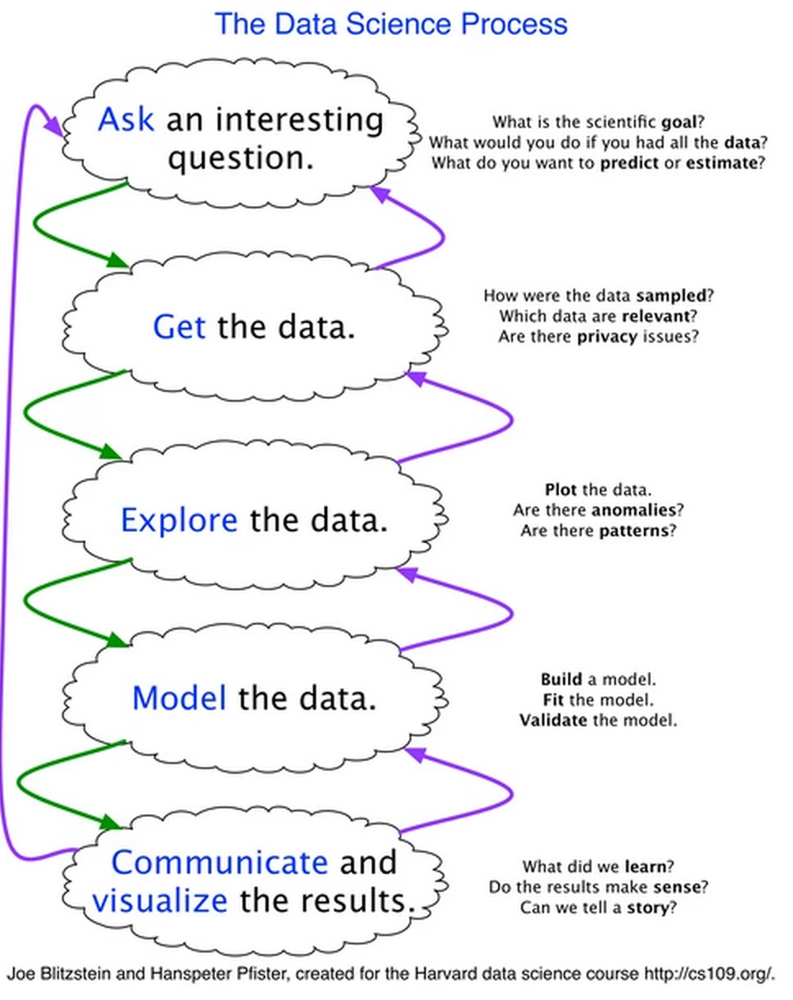

Introducción al Hacking Cívico desde Datos Abiertos
=====

¡Bienvenido a esta noche de Hacking! Esta noche trabajaremos cosas muy interesantes en relación a la pobreza en nuestro país.

Si es la primera vez que vienes, y que escuchas la frase hacking cívico, seguro te llama la atención el uso de la palabra Hacking. Aquí usamos la definición:

**Hacking**: Es una solución astuta a un problema complicado “Hackear” es cambiar algo de manera extraordinaria.

Y,

**Hacking Cívico**: Ingenieros, tecnólogos, ciudadanos, científicos, diseñadores, artistas, educadores, estudiantes, emprendedores. Cualquiera dispuesto a colaborar con otros para crear, construir e inventar soluciones públicas, código y tecnología para resolver retos relevantes a nuestras comunidades, ciudades, estados y país.

Estamos aquí para hacer un cambio extraordinario en nuestra localidad usando tecnología. Como primer paso, aunque suene cursi, Vamos a conocernos como equipos. Te pido de favor que platiques con el grupo que has formado, y conozcan más los intereses de cada uno de ustedes: Esto ayudará a que sepamos más lo que nos gusta y, aquí entre nos, nos hará más eficientes y efectivos para hacer cosas bien chidas hoy.

Datos abiertos
-------

Ya lo hemos platicado un par de veces hoy, pero hoy en día en México hay varias fuentes de información de buena calidad que nos permiten conocer problemáticas sociales actuales. Dos ejemplos son:

[datos.gob.mx](www.datos.gob.mx) - La fuente de datos que la estrategia digital nacional de parte de la presidencia de la república

[datamx.io](www.datamx.io) - La fuente de datos que trabaja Codeando México, que viene desde la sociedad civil.

Ambas son bien interesantes, lo importante, es que puedes sacar información chida de ambas.

El Proceso de la Ciencia de Datos
-------

Estas fuentes de información son bien interesantes, pero al final solo representan la materia prima del proceso de la ciencia de datos, que se describe a continuación:

Hoy vamos a hacer precisamente eso, a usar esa matería prima con el objetivo de entender mejor una problemática usando este proceso.  De acuerdo a tus habilidades, es posible que tiendas a poder sentirte más a gusto con alguna de las partes ¡Esperamos que eso pase!

Los datos del día de Hoy
--------

La pobreza en México es un tema bastante discutido pero poco entendido, y un ejemplo de como una estadística puede diluirse cuando no se le presta la importancia necesaria. ¿Quién no ha escuchado que en México tenemos más del 50% de pobres? ¿Qué significa eso? Hoy vamos a conocer más ese tema, y qué significa.

La CONEVAL ha preparado una base de datos bien interesante con los indicadores de pobreza y su evolución. Unos indicadores, desde 1990 por década, y otros indicadores desde el 2000, cada 5 años. Lo más interesante, es que están por localidad

Esta base la puedes encontrar en el vínculo de aquí abajo:
[Indicadores de pobreza - datos.gob.mx](http://catalogo.datos.gob.mx/dataset/indicadores-de-pobreza-pobreza-por-ingresos-rezago-social-y-gini-2010-municipal)
El diccionario de datos, es decir, el significado de cada columna, está localizado en el siguiente vínculo:
[Diccionario de Datos -  Indicadores de pobreza](http://www.coneval.gob.mx/Informes/Pobreza/Datos_abiertos/Indicadores_municipales_sabana_DIC.txt)

**Un subtema recomendado**
Una base de datos bien interesante para cruzar es la cantidad de estudiantes matriculados en cada institución de educación superior del País. ¿Cómo se relacionará el lugar donde hay una universidad, con los indicadores de pobreza? Notarán que no está la dirección la institución en la base de datos por lo que no es tan sencillo encontrar el municipio en el que se encuentra, ¿Cómo la encontrarían?

Esta base la puedes encontrar aquí:
[Matrícula por Institución y Entidad federativa](http://catalogo.datos.gob.mx/dataset/matricula-por-institucion-y-entidad-federativa)

**Find your own topic**

Definitivamente este dataset de pobreza tiene un potencial muy grande para conocer que es lo que pasa en nuestro país. ¿Porqué no buscas otra base de datos que estaría interesante cruzar? ¿Qué tal alguna que hable de población? ¿De fenómenos naturales?

Entonces, ¿Qué hacemos?
---------

El plan para hoy es este:

1.	Trabajaremos los primeros pasos del proceso la ciencia de datos
2.	Formularemos en equipo una pregunta que nos interese a partir de la información
3.	Obtendremos los datos que nos falten para contestar la pregunta
4.	Procesaremos la información y la exploraremos para encontrar la respuesta
5.	Adelantaremos lo más que podamos la visualización de la información, pero sería increíble que nos lo llevaramos para colaborar en algo que trascienda a esta noche. 

Te invitamos a que veas la sección de recursos para encontrar herramientas para los pasos de la ciencia de datos. No te preocupes si no sabes programar y los datos están en csv. Deberían de abrir sin problema en tu Excel/LibreOffice.

Sabemos que lo que hagamos aquí solo es el primer paso de algo más grande. ¿Porqué no te pones de acuerdo con tu equipo para seguirle después de esta hack night? A continuación te ponemos algunas recomendaciones de como hacer esto.

Proyectos que permanecen
--------

Recomendamos que el primer paso que hagan al formarse como equipo, es que hagan un repositorio donde suban las cosas que van a utilizar. Github es el favorito para esto. Si apenas estás aprendiendo, pregúntale al programador de tu equipo. Si no, no pasa nada, una carpeta pública, como una dropbox funciona. 

Te invitamos a aprender a usar github! Aquí unas guías que te pueden ayudar:

[Git ¿Merece la pena?](http://bicosyes.com/2008/06/git-%C2%BFmerece-la-pena/)
[Git - La Guía Sencilla](http://rogerdudler.github.io/git-guide/index.es.html)
[Try git](https://try.github.io/levels/1/challenges/1)

Por favor, incluye el link a su proyecto en el pequeño foro que tenemos al final de está página. Así también nosotros podemos saber que paso esta noche, y después de hoy (:

¡Haznos saber tu opinión!
--------

Te agradecemos un montón que vinieras el día de hoy. Nos encantaría saber que es lo que más te gustó y que no te gustó de este evento ¡Queremos mejorar! 

Aquí la forma para que nos dejes tu opinión: [hhttp://bit.ly/1CS4SK7](http://bit.ly/1CS4SK7)

Muchísimas gracias, y nos vemos bien pronto ( Y más pronto si haces un repo de git (:)

Foro de Discusión / Link a tu proyecto
--------

[gimmick:Disqus](dataexploreh)