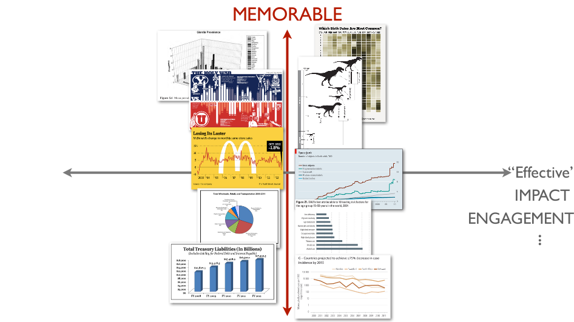
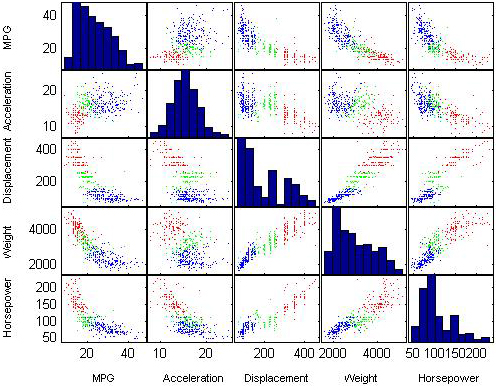
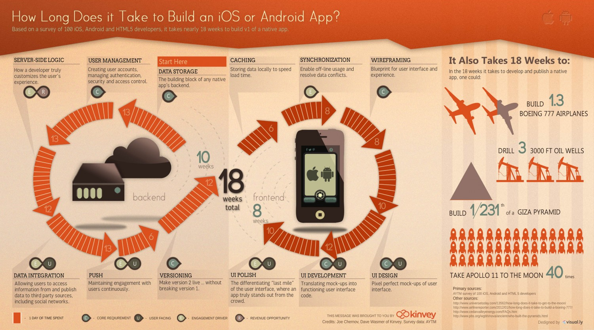

Introducción - Civic Hack Night de Visualización con Bosque Urbano México.
=====

Hoy estaremos trabajando con conceptos de visualización, en el marco de los datos que han hecho disponible los miembros de Bosque Urbano México. Analizaremos la información y luego desarrollaremos dos visualizaciones: Una que explorará el comportamiento de los usuarios y otra que detallará las características disponibles de los árboles. 

Toda esta ṕágina está en github, por lo que si necesitas bajar todo de golpe o usar este proyecto de base, no dudes en forkearnos (:

Sobre el dataset - Bosque Urbano México
--------

Bosque Urbano México es una organización basada en Monterrey que tiene 4 objetivos principales: 

  * Crear un inventario de árboles urbanos
  * Compilar un catálogo de especies nativas
  * Crear una plataforma de participación urbana
  * Un cuantificador de beneficios ambientales

El esfuerzo de esta organización está almacenado en la base de datos que accederemos hoy, que contiene el lugar, especie y usuario que registra cada uno de los árboles que tenían almacenados a mediados de agosto del 2014. Usaremos el poder de la visualización de los datos para conocer más de los usuarios, y conocer más de los árboles que están instalados. 

La base de datos contiene un registro por cada arbol, presentado de la siguiente manera:
arbol_id, folio, usuario_id, fecha_plantado, especie, fecha_registro, Municipio, Dirección.

Un proceso para hacer hacking cívico a partir de datos es el siguiente:

  * Encontrar actores principales 
  * Encontrar columnas que describan las características de actores
  * Proponer relaciones interesantes entre los datos
  * Buscar información faltante o complementaria a los actores
  * Proponer soluciones reales a la problemática encontrada

En este caso, mi análisis con estos pasos arrojó lo siguiente. En mi opinión, los dos actores más fuertes en esta base de datos son los usuarios y los árboles. Los primeros los analizaré para encontrar relaciones interesantes del uso de la plataforma; Y lo relacionado con los árboles, para encontrar información interesante de su sembrado en la geografía de la zona metropolitana de Monterrey.

De las bases de la visualización
-------

Los expertos de visualizacion, mediante pruebas a usuarios, han probado que hace una visualización memorable o fácil de entender. Encontraron que una gráfica que es tradicional (Gráfica de barras, gráficas de disperción, entre otras) es fácil de entender pero fácil de olvidar. Por otro lado, una gráfica menos tradicional, como algo metafórico o visualmente más atractivo, puede ser más dificil de entender, pero será más fácil de recordar. Esto se resume en la gráfica siguiente:

Las dos dimensiones de las visualizaciones, que tan efectiva es versus que tan memorable es.

Por ello, cuando se trabaja con un conjunto de datos, se usan dos tipos de visualizaciones: Las que te sirven a ti, como analista de información, a procesar la información con la que estás trabajando; A esas se le llaman visualizaciones de exploración. Estas tendrán características más fáciles de entender y seguir, y te permiten ver patrones de manera clara. 

Un ejemplo de una visualización hecha para encontrar patrones en la información

 Por otro lado, existen aquellas visualizaciones que están hechas para comunicar el resultado de esa invesigación, por ello se le llaman visualizaciones de comunicación. Muchas veces, se prefieren usar metáforas más profundas para que el mensaje sea más poderoso. Al conjunto de esas metáforas y otras gráficas con la intención de dejar una memoria profunda en el espectador se le llaman Infografias.

Un ejemplo de una infografía, el caso extremo de una visualización gráfica

Para tomar inspiración, te recomendamos el sitio de la [Tabla periodica de los métodos de visualización](http://www.visual-literacy.org/periodic_table/periodic_table.html). Es un excelente resumen de las diferentes formas de comunicar información que existen. 

