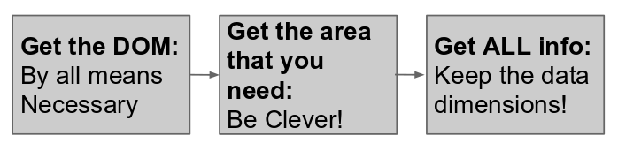

Introducción - Hack Night de liberación de información
=====

Este día estaremos trabajando con Web scrapping: El arte de recuperar datos desde un sitio Web. Veremos primero los pasos para el scrappear, y luego veremos un ejemplo de un caso que terminó en el periódico. Al final recomendaremos algunos lugares para probar nuestras habilidades. 

Toda esta ṕágina está en github, por lo que si necesitas bajar todo de golpe o usar este proyecto de base, no dudes en forkearnos (:

Sobre el Tema - Scrapping
--------

Wikipedia define el scrapping como una técnica para extraer información desde sitios, usando programas que simulan la exploración humana de la Red. Dejando definiciones a un lado, el scrapping se trata de recuperar información que está disponible en web para tenerla ahora como recurso base. 

Los pasos del scrapping
--------

En lo técnico, el proceso para scrappear un sitio tiene tres fases:

Todo empieza con una fuente
---------

Cuando llegamos al scrapping, pocas veces se inicia sin tener un proyecto detrás. Cada caso es diferente. En la página de Casos te ponemos algunos ejemplos de sitios que tienen información que puede ser scrappeada. Por supuesto, ¡Tú puedes probarte con cualquier sitio!