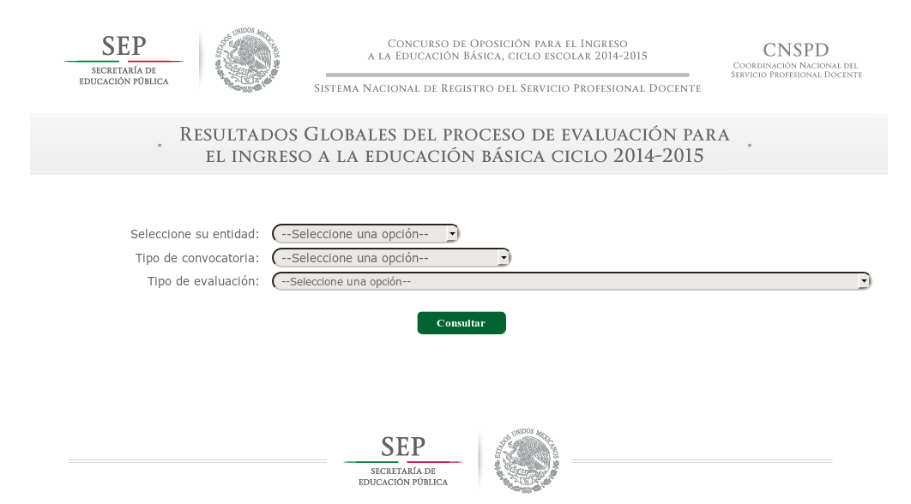

Ejemplo de Scrapping
============

Introducción
------------

Hay una anécdota con la base de datos que scrappeamos con el código que te mostraré. La gente del Instituto Mexicano de la Competitividad, [IMCO](www.imco.org.mx) nos recomendó que scrappearamos el sitio:

[http://201.175.44.226/SNRSPD/Basica/SNRSPDresultadosbasica/ConsultaPublica.aspx](http://201.175.44.226/SNRSPD/Basica/SNRSPDresultadosbasica/ConsultaPublica.aspx)

Como verás, es un sitio que parece inofensivo. En el se muestran los resultados de los exámenes del los maestros de educación básica. Un Menú "dinámico" que muestra los estados de la republica, la convocatoría y el examen. Es una página práctica.

Si no quieres hacer análisis de información.

Si te quieres enterar como les fue a **Todos** los maestros. Es imposible si no scrappeas la información: Tendrías que irte en 32 estados, a 2 convocatorias, con muchísimas opciones. Por lo tanto, nos embarcamos en el proceso que te muestro a continuación para sacarle los datos. Dándo una fast forward: Un día después de publicar estos datos en la plataforma [www.datamx.io](www.datamx.io) nos avisan que Sonia del Valle, una reportera del Reforma, está interesada en los datos.

Una semana después:

Este es el impacto que puede tener el abrir información ¡Por eso te animo a que aprendas a hacerlo! Esta es solo una aplicación, definitivamente en lo comercial hay un potencial increíble.

Nuestra solución
------------

Nosotros usamos un código en Python que puedes encontrar en github [en esta dirección](https://github.com/CodeandoMexico/los-scrapers/tree/master/script/sep)

En el, podrás ver las diferentes etapas del scrapping. Perdonarás el código, que todavía tiene que refinarse bastante.

Para replicarlo, depende de tu sistema operativo.

*	Si tienes linux, Instala porfavor el ambiente de Python. Te recomiendo que instales además iPython; Que tiene una funcionalidad increíble que es el notebook.
*	Si tienes Mac, te recomiendo esta liga [para empezar](http://joernhees.de/blog/2014/02/25/scientific-python-on-mac-os-x-10-9-with-homebrew/)
*	Si tienes Windows, te recomiendo el paquete [Anaconda](http://continuum.io/downloads). También hay para Linux y Mac, pero en esos sistemas prefiero una instalación natural. Para instalar librerías que no trae, te fallaré; Pero no debe de ser muy dificil (:

El código
------------

Usamos varías librerías en el código. Resaltan:

*	dryscrape - Que nos permite simular un navegador web (Recuerdas la definición de scrapping según Wikipedia), con tal de obtener la página que nos interesa.
*	beautifulsoup - Que nos permite explorar el código de una página de una manera organizada, explorándolo como listas y diccionarios de acuerdo a los componentes del mismo.
* 	csv - Que nos permite guardar de manera muy sencilla los archivos 

Como vimos antes, el scrapping tiene varias etapas. Cada una de ellas está representada por una función muy específica del código:

*	Obtener el DOM - Getbody
*	Extraer el área de interés - Scrappetable
*	Ordenar la información y presentarla - Printcsv

Para obtener los valores que necesitamos para cada tabla nos metimos al source de la página y los sacamos a mano (: para otra versión, hice algo más dinámico. ¿Cómo lo harías tú?

Yo se que mi código no es el mejor ¡Se aceptan contribuciones!

Walkthrough
------------

El Walkthrough lo sacaremos en vivo. En caliente :D

Recomendaciones
------------

Al final, los datos que abrimos los queremos poner en una plataforma donde se puedan consumir. Sin querer meter gol, ahí esta [www.datamx.io](www.datamx.io). Sin embargo, vale la pena recordar algunas reglas para tomar la información que viene de estas fuentes para que esté facilmente accesible. 

Los mandamientos de la información para Datamx son los siguientes:

*	Convertir tu archivo a CSV.
*	La primera fila debe tener nombre de las columnas.
*	Los nombres de la columna no deben de tener espacio, usa el guión bajo de preferencia.
*	Procura que sean nombres de columna de máximo 20 caracteres.
*	No dejar celdas en blanco.
*	Trata de no poner comas en los valores que tienes en tu CSV, aún y cuando estén adentro de comillas!
*	Usa Encoding UTF-8.
